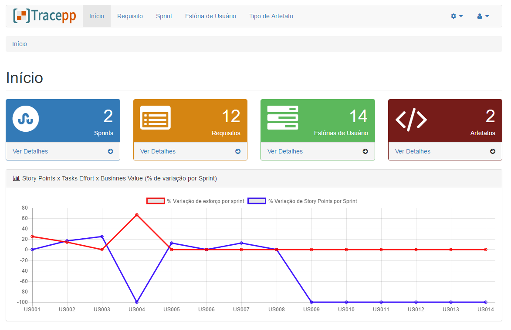
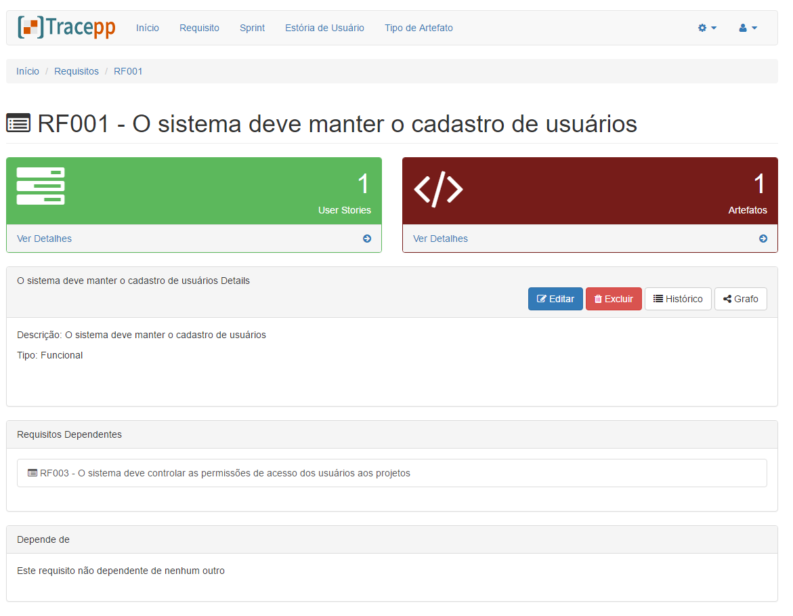
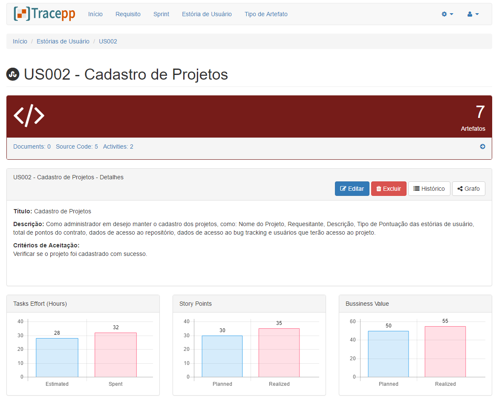
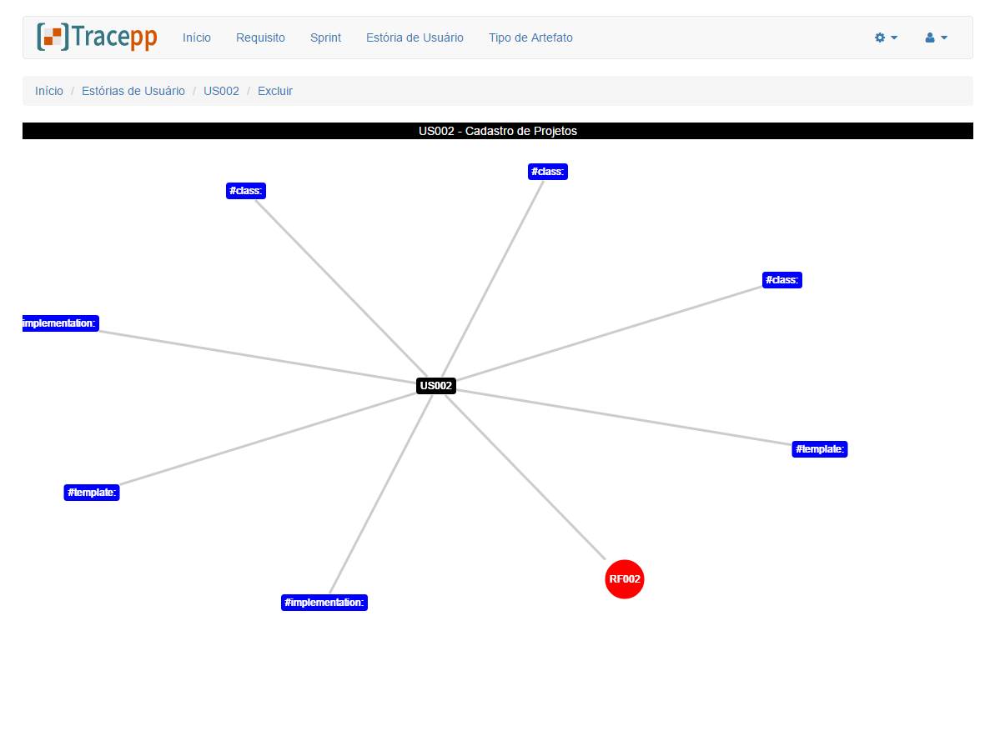

<H1>Tracepp requeriments traceability tool</H1>

Tool to help in the requirements traceability. The aim is to facilitate traceability
processes in order to reduce the impact of these activities on the development team's.
Provides integration with Redmine and GIT repositories to obtain the artifacts and trace the artifacts with project, requirements,
sprint or user stories according to user defined tracking codes.

This tool is part of the research project of the Master in Software Engineering of CESAR.EDU.

<h2>Screens</h2>

Initial Screen

Requeriments Screen

User Story Screen

Traceability Graph

<h2>Run:</h2>

Python 3.5 and Django 1.10

<h2>Dependencies</h2>
<ul>
<li>GitPython</li>
<li>Pygments</li>
<li>django-simple-history</li>
<li>python-redmine</li>
</ul>

<h2>TODO</h2>

Tests,  PIP Installer and documentation

<h2>LICENCE</h2>

Distributed under the GNU General Public License version 2 or later
